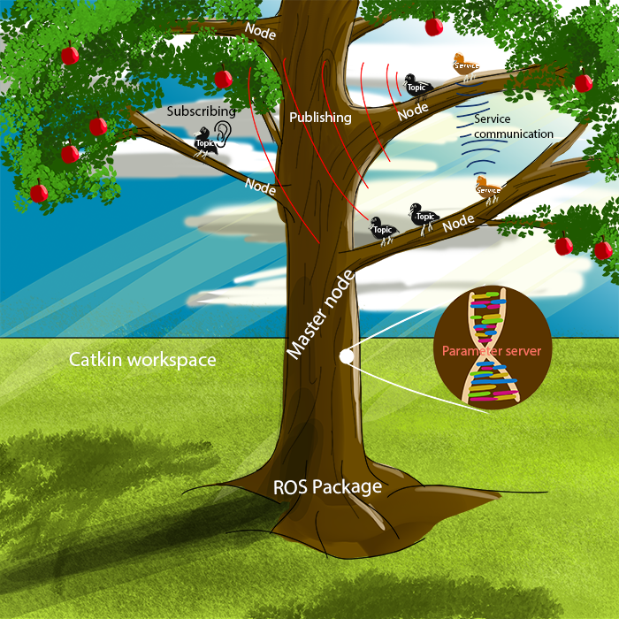

Jargon: Technical Terminology pertaining to ROS {#JargonSection} 
===============

This page introduces an absolute beginner to the most essential terminologes of ROS. All the terms on this page are explained with help of metaphorical presentation, which hopefully helps reader to understand the important concepts.

__Time to read:__ 10 minutes

## Basic concepts of ROS

Imagine ROS being an apple tree on a farmland as shown below.

__Catkin Workspace: an apple tree plantation / farm__

To grow apple trees, you first need space (like a farm or patch of land) to grow them and to plant the seeds. Simlarly, in ROS, you need a workspace that keeps all the necessary things you would need. This is called the *catkin workspace* which is the farmland for planting and growing ROS components. In real life, one can have multiple farms, similarly, it is possible to use as many catkin workspaces as you want.

__ROS Package: an apple tree__

Now that we have the farm, we can start planting the seeds to grow the apple trees themselves. Like the apple trees in the farm, *ROS packages* in the catkin workspace are what we are trying to grow or develop.

__Master node: tree trunk__

An apple tree itself consists of multiple parts. After growing the roots,the tree trunk is the first things to grow. In ROS, inside the catkin workspace, you have a *master node* (tree trunk) that is keeping track of the bigger picture of what is happening at runtime. It keeps track of which nodes are open, the relationships between the nodes and the *Parameter Server*, which contains global variables of the ROS package.

__Nodes: branches of tree__

Now that we have the tree trunk, we can finally grow the *branches* out of the tree trunk. Remember that we need the branches to grow apples themselves. In ROS, these branches are the software modules of the ROS package, which is responsible for executing one major function, such as SLAM.

__Topics: birds on branches of tree__

Imagine that you now have an apple tree with several branches. On each of these branches, there are birds sitting and chirping to other birds sitting on other branches. These birds can listen to other birds or chirp themselves so the other birds can hear them. In ROS, *a topic* is like one bird. They are the "radio channels" for the data, which any node in the ROS package can *publish* (chirps) to or *subscribe* (listen to other birds) to. Any bird can listen to the chirping bird. This makes the topics great for open and continuous messaging. However, The birds do not always want to chirp continuously, hence there are also other communication methods available.

__Services: the ability to recognize a specific bird chirp from the crowd__

The birds have an incredible ability to recognize and distinguish specific chirps from the others. This ability allows mama bird to call out for its child and the child to respond to mama's call. With this two-way communication, the mama bird can find and locate the child bird. ROS has this kind of ability as well. *Service* allows two nodes to communicate peer-to-peer. One node offers a service and any other node can start communicating with it through consecutive *request* and *reply* messages. This method is effective for interactive yet short-bursts of communications.

__Parameter server: the tree DNA__

The branches of the tree need a lot of information to know what kind of apples to grow and how to grow them. Therefore, evolution has developed an incredible way to share information to future specimen, DNA. The tree continuously looks at the DNA to see what the apple it is growing should be like. It even uses the DNA to grow the whole tree itself. In ROS, we have a parameter server that similarly to DNA acts like a storage to store and retrieve different parameters at runtime.  

## Recommended next step

You should be familiar with basic ROS terminology. Now we can move on to ROS installation and after this, we will explore the farmland or so called catkin workspace. To get ROS installed, click [here](@ref GettingStartedSection).