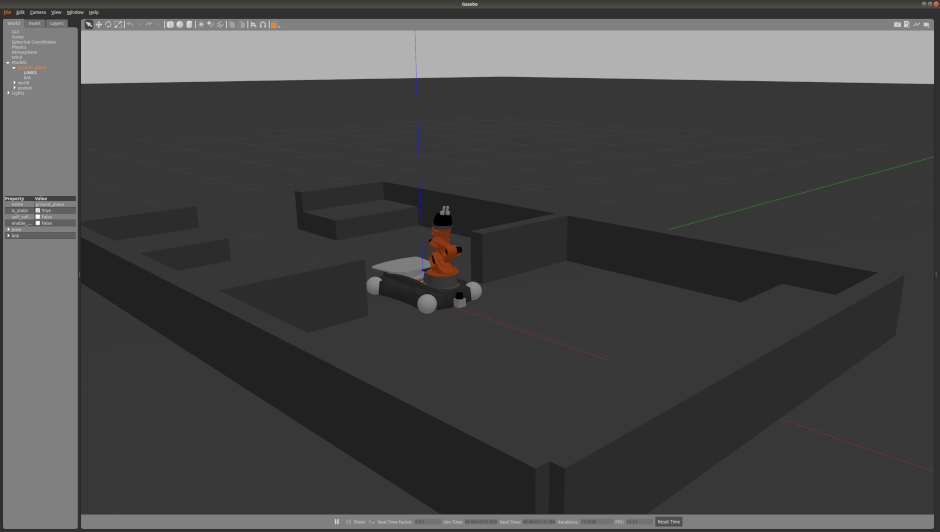
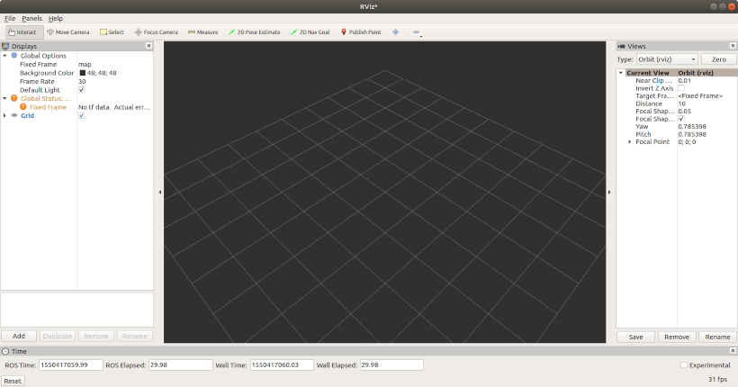
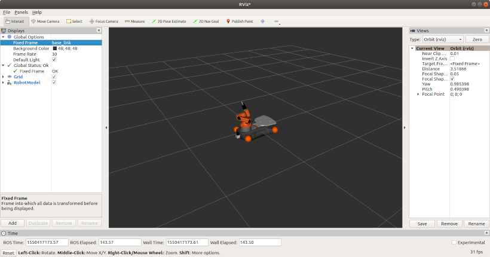
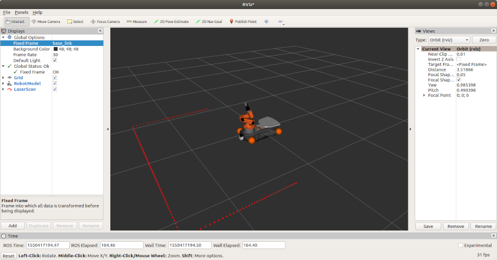
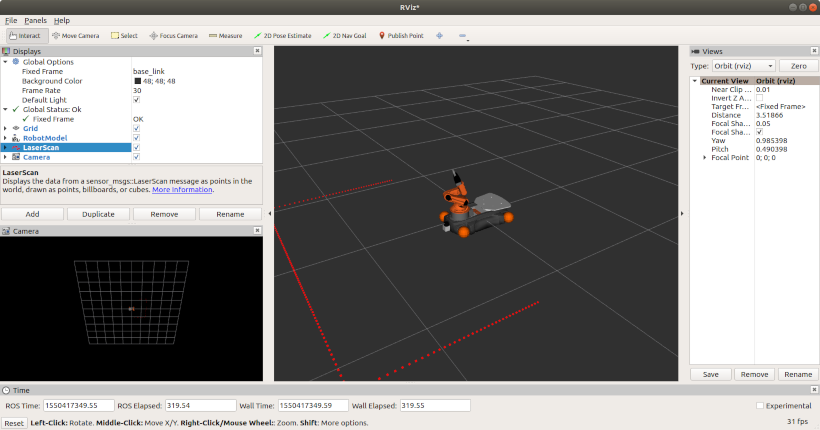

Simulators {#SimulatorsSection}
===============

__Prerequisites:__ 

- [Jargon Section](@ref JargonSection) 
- [Example ROSject Section](@ref ExampleSection)

__Duration:__ 45 mins

ROS comes with in-house simulators to visualize the robot and implement the experimental scenario for quality assurance and testing purposes. This segment describes two such simulators in details and helps the readers get setup with generating a test environment.

Robot models in ROS (joints, links, geometries, sensors etc.) are expressed in `.urdf` files. It is common, however, to create the model in another type of file: `xacro` files, which are a more user-friendly variation of URDF. ROS `launch` files can can spawn robot models expressed in `.urdf` or `xacro` format to the parameter server, and after this the robot model can be used in the different ROS simulators. A combination of URDF-, xacro- and launch files will be used on this page for spawning the Youbot in the simulators.

The two simulators that will be described are **Gazebo** and **RViZ**. These are the two most widely used simulators in ROS, so if you know how to use them both, you will be a very capable Roboticist. They are both simulators, but they simulate different things:

- Gazebo is a 3D dynamic __physics simulator__. It simulates physical objects moving around in a 3D world. This can be everything from controllable Robots to stiff collision objects.

- RViZ is a 3D dynamic __robot simulator and visualizer__. It can simulate and visualize every aspect of the robot, from robot arms and manipulators to robot sensors such as cameras and LiDARs. In other words, RViZ visualizes and simulates __what the robot can see and do__.

## Setup

### Installing simulation dependencies

First, in order to utilize the simulation tools, we will need some more dependencies.

	sudo apt-get install ros-<YOUR_ROS_DISTRO>-ros-control ros-<YOUR_ROS_DISTRO>-ros-controllers ros-<YOUR_ROS_DISTRO>-gazebo-ros-control

For example, if you are using ROS melodic:

	sudo apt-get install ros-melodic-ros-control ros-melodic-ros-controllers ros-melodic-gazebo-ros-control

### Installing model and simulation files for Youbot

For simulating the Youbot, we will need the files that describe this robot (urdf-, xacro- and launch files). All the Youbot model and simulation files needed, are publicly available on Github. In order to use them, we need to build them from source:

First, go to the `src` folder of your catkin_workspace directory

	cd <your_catkin_ws>/src

Fetch the model files from Github:

__Note:__ even if you are using melodic, do not worry about the `kinetic-devel` below. There is no Youbot version specifically for melodic so we are going for the most recent existing version of Youbot, namely kinetic. It should be compatible with melodic as well.

	git clone http://github.com/youbot/youbot_description.git -b kinetic-devel

Fetch the simulation files from Github:

	git clone https://github.com/youbot/youbot_simulation.git

Build your workspace

	cd ..
	catkin_make

## Gazebo

Gazebo is a 3D dynamic physics simulator. It is a standalone program that can work independently from ROS. Gazebo can be integrated into ROS using the package group `gazebo_ros_pkgs`.

Gazebo should have been automatically installed with the default ROS installation instructions (also, if you used the auto-install script on this tutorial). Your Gazebo version will depend on what ROS distribution you are using.

As previously mentioned, ROS describes robotic models in URDF files. Gazebo describes 3D models in SDF files. `gazebo_ros_pkgs` takes care of converting one format to another. This way you can spawn the robots, which you have defined in URDF or xacro format, in the Gazebo environment.

### Launching Gazebo

To launch Gazebo, simply run

	gazebo

and the Gazebo window with an empty world should appear.

If you want to use Gazebo with ROS, you can run it as a ROS node (close the empty Gazebo simulation first if you ran the previous command):

First run ROS master:

	roscore

In another terminal window, run gazebo as a ROS node:

	rosrun gazebo_ros gazebo

### Spawning the Youbot in Gazebo

Update your ROS environment

	source devel/setup.bash

Run the launch file for Youbot in Gazebo

	roslaunch youbot_gazebo_robot youbot.launch

A Gazebo window should show up looking like this:

On the next page, you will get the chance to control this robot with your keyboard arrows. But before that, we will demonstrate how to launch the robot in RViZ.

## RViZ

RViZ is a ROS package that can visualize several aspects of a robot like:

- Sensor data
- Robotic arms and manipulators
- Planned trajectories
- Robotic movement
....and much more

### Getting RViZ up and running

RViZ should be automatically installed with any default ROS desktop installation (or the auto-install script of this ROS tutorial). To launch RViZ:

Start a ROS master node

	roscore

In another window, run rviz ROS node

	rosrun rviz rviz

This window should show up:

Now you can launch a robot model (with roslaunch from a urdf/xacro file) into the parameter server and RViZ can visualize it. This is what we will show next. You can close all terminal windows if you want.

### Spawning the Youbot in RViZ

RViZ works by visualizing topics. These topics can for example be robot joint configurations or robot sensor data. We will visualize the Youbot robot model, so we need to launch some Youbot nodes that publish this data.

Firstly, launch the Youbot robot model

	roslaunch youbot_gazebo_robot youbot.launch

A Gazebo window will open up automatically. You can close the Gazebo window (it can use up quite a lot of computational resources). We only need the ROS nodes, topics and the model of the Youbot in the parameter server to be launched.

Next, in another terminal window, run RViZ

	rosrun rviz rviz

In RViZ, on "Displays" window on the left, click on "Add". A new "Create visualization" window should open up.

Select RobotModel and click OK. 

On "Displays" window change the parameter "Fixed Frame" to base_link.

Now the Youbot robot model should be visible in RViZ. Like this:

In order to get access to the coordinate frames and configurations of all the joints of Youbot, you can add Tf to the Displays (i.e. "Transformation frame"). You can take a look at the values of the joints. The visualization should match the robot joint configuration.

You can visualize any currently running topic, which is in a format that RViZ supports. For example, if the robot uses a LiDAR sensor whose data gets published to a topic, RViZ can visualize the continous flow of data. The Youbot launch file which we recently launched utilizes the youbot.urdf.xacro as a reference for the robotic model of the Youbot. This xacro file contains a laser scanner, which publishes its data to the topic /base_scan. This topic is in a suitable format to be visualized in RViZ. Let's visualize that topic next:

First, click Add and switch to the tab "By topic". On this tab you will see all the currently publishing topics which are compatible with RViZ. 

Select "LaserScan" under topic /base_scan and click OK.

Now you the laser scan data of the Youbot will be visible on the visualization window. Like this:

If you have a camera connected to your robot, RViZ can visualize the raw camera feed. To get this to work you need to setup the camera so that its data flow gets published to a topic. When your camera setup is ready you can show the camera feed simply by:

Click Add and select Camera.

Change the "Image topic" to the topic where your camera publishes its data. Now, your camera feed should be visible in a separate window on the left. Like this:

## Recommended next step

Now when you have been introduced to the two most common ROS simulators, let's put the theory into practice and take Youbot for a ride in Gazebo [here](@ref TeleopSection) . 