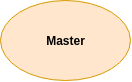
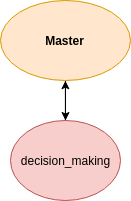
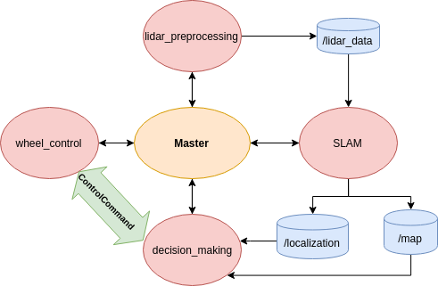

Toy ROSject{#ExampleSection} 
===============

This page provides a toy example of a complete ROS project a.k.a. ROSject. The previous page on [Jargon and Commands](@ref JargonSection) introduced the most basic ROS concepts. On this page, it will be demonstrated how to actually build a ROSject from scratch where these principles are applied (we will finally show how to plant the apple tree). It is only a toy example, meaning its purpose is purely educational. The code is executable and running the package will result in the node network, topics and services desired. Notice that the nodes are performing rudimentary operations (not actual SLAM!). This project aims to demonstrate the basic ROS concepts like:

- Catkin workspace
- Nodes
- Topics
- Service
- Launch files
- Building project
- Executing project
- ROS commands

The ROSject which is created here, `youbot`, will already be ready-to-use with the catkin workspace provided with this tutorial. This means that you don't actually have to do many of the follwing steps, since they are already done. The steps are simply meant to provide a template for you to go through when you are creating your *own* ROSjects. The `youbot` resides inside toy_rosject directory in the ros101 repository.

__Prerequisites:__
  - Linux: Ability to use the terminal
  - ROS: Familiarity with [Jargon](@ref JargonSection)
  - Followed the steps on [Installing ROS and setting up your system](@ref GettingStartedSection)

__Duration:__ 90 minutes

## Setup

In order for you to be able to test this ROSject, you have to import it to your catkin workspace. You can do that by following these steps:

1. Make sure that the `youbot` ROSject exists in your catkin workspace. If it is not there, move it

        mv ros101/toy_rosject/youbot <LOCATION_OF_CATKIN_WORKSPACE>/src

2. Build your workspace

        cd <LOCATION_OF_CATKIN_WORKSPACE>
        catkin_make

## Explanation of how the ROSject works

Now, let's go through each aspect of this ROSject by explaining all its parts. You will not have to execute any of the steps on this chapter, but you will hopefully get an idea of the process of creating a new ROSject. Feel free to use this guide as a template for when you are creating your first ROSjects of your own.

So, let us say that we want to create a ROSject called `youbot` which is aimed to perform all the operations required for autonomous navigation of this mobile robot:
- Preprocess LiDAR data
- Perform Simultaneous Localization and Mapping (SLAM)
- Make higher level decisions on where to go
- Control the 4 wheels to reach the goals

These software modules can be conveniently split up into separate ROS nodes that we will call: `lidar_preprocessing`, `slam`, `decision_making`, and, `wheel_control` respectively.

In addition to these nodes, they will make the use of ROS topics and services in order to communicate with each other. More specifically, the structure will be:

- `lidar_preprocessing` outputs the preprocessed LiDAR data to the topic `/lidar_data`
- `slam` reads from topic `/lidar_data` and outputs the computed map and position of the robot to topics `/localization` and `/map`
- `decision_making` reads topics /localization and /map. Based on this data, it makes computes the decision and sends a control command to `wheel_control` node via a service called ControlCommand
- `wheel_control` reads the control command from the decision_making node and controls the 4 wheels in order to reach the goal

The process will be:

1. We initialize this package in our catkin workspace:

        catkin_create_pkg ​ youbot rospy roscpp

  __Note:__ *rospy is Python package for ROS, while roscpp is C++ package for ROS. Even though we are using exclusively Python, C++ is required for many of the dependencies that will be used in background. For any ROSject, it can be safe to assume that these two packages will be needed*

2. We make the configurations to our new ROSject required for getting Python to work (check out *Configuring your new ROSject* on [Getting started](@ref GettingStartedSection))

3. We create the files for our 4 ROS nodes.

4. We create a Service file that describes our own custom Service `ControlCommand`

After these steps `catkin_make` should run successfully.

The resulting directory structure should look like this (you can ignore the launch folder for now, it will come later):

    └── youbot/
        ├── CMakeLists.txt
        ├── include
        │   └── youbot/
        ├── launch/
        │   └── youbot_basic.launch
        ├── package.xml
        ├── scripts
        ├── setup.py
        ├── src/
        │   ├── __init__.py
        │   ├── decision_making.py
        │   ├── lidar_preprocessing.py
        │   ├── slam.py
        │   └── wheel_control.py
        └── srv_file_name/
            ├── __init__.py
            └── ControlCommand.srv

### Programming the nodes

Now, we can program our nodes.  To make it easier for you to understand how the ROS code works, only the key functions will be introduced first, and after that the complete source code will be presented. Carefully observe how the `topics` and `services` work and try to recollect the farming example to connect them.

#### lidar_preprocessing.py:

This node needs to do these things:

- Preprocess raw data received from LiDAR
- Publish the preprocessed data to topic /lidar_data

This is a tutorial for ROS and not for data preprocessing, so we will just define a nonsensical function that takes raw data as input, processes it and outputs the preprocessed data.

    def preprocess_data(raw_data):
        data = raw_data/1234 # Replace with some real preprocessing algorithm here
        return data

Next, let's define the functionality for our node in a separate function called *lidar_preprocessing()*
  ```{.py}
  def lidar_preprocessing():
  ```

First we will have to tell ROS that this is a node called lidar_preprocessing.
  ```{.py}
  rospy.init_node('lidar_preprocessing', anonymous=True) # "Initialize node with name lidar_preprocessing"
  ```

Next, we will create a publisher object that we will use for publishing to /lidar_data
  ```{.py}
  pub = rospy.Publisher('/lidar_data', Float32, queue_size=10) # "This node publishes to the topic /lidar_data with format Float32"
  ```

Now we are ready to define what the node will loop through continously:
  ```{.py}
  loop_rate = rospy.Rate(50) # Specify rate of 50Hz (this variable will become handy when specifying the frequency of executing the loop)
  while not rospy.is_shutdown(): # Run loop until rospy is interrupted
      raw_data = 666.0 # Just some dummy variable. Pretend that this is the raw output of the LiDAR sensor
      data = preprocess_data(raw_data) # Preprocess the data
      pub.publish(data) # Publish the preprocessed data to topic /lidar_data
      loop_rate.sleep() # Sleep for 1/50 seconds
  ```

Here is the complete code of the lidar preprocessing node:
  ```{.py}
#!/usr/bin/env python

import rospy
from std_msgs.msg import Float32


def preprocess_data(raw_data):
    """
    Function to get current velocity (speed and heading direction)
    :param raw_data: raw data to be processed

    :return: preprocessed data
    :rtype: Float32
    """
    data = raw_data/1234 # Replace with some real preprocessing algorithm here
    return data


def lidar_preprocessing():
    """
    Main function for lidar_preprocessing.py node
    """
    rospy.init_node('lidar_preprocessing', anonymous=True) # "Initialize node with name lidar_preprocessing"
    pub = rospy.Publisher('lidar_data', Float32, queue_size=10) # "This node publishes to the topic /lidar_data with format Float32"
    loop_rate = rospy.Rate(50) # Specify rate of 50Hz (this variable will become handy when specifying )

    while not rospy.is_shutdown(): # Run loop until rospy is interrupted
        raw_data = 666.0
        data = preprocess_data(raw_data) # Preprocess the data
        pub.publish(data) # Publish data to topic /lidar_data
        loop_rate.sleep() # Sleep for 1/rate

if __name__ == '__main__':
    try:
        lidar_preprocessing()
    except rospy.ROSInterruptException: # This exception is thrown if the node is somehow shutdown (e.g. with Ctrl+c)
        pass
  ```

#### slam.py:

This node needs to do these things:

- Subscribe to topic /lidar_data
- Perform SLAM based on this data
- Publish SLAM results to topics /map and /localization

The subscribing is easy. We just define what node is being subscribed to....
  ```{.py}
  rospy.Subscriber('/lidar_data',Float32,callback_function) # Get node to subscribe to topic /lidar_data. Whenever something is published on that topic, callback_function is called
  ```

...and what happens when that topic publishes something
  ```{.py}
  # Function that is called each time something is published on topic lidar_data
  def callback_function(data): 
      perform_slam(data.data)
  ```
Again, this is a tutorial for ROS and not for SLAM, so perform_slam is a dummy function which does something nonsensical with the input data and publishes it to the topics /map_data and /loc_data.

The "main function" for the slam node is the following:
  ```{.py}
  def slam():
    rospy.init_node('slam',anonymous=False) # Initialize node slam
    rospy.Subscriber('/lidar_data',Float32,callback_function) # Get node to subscribe to topic /lidar_data. Whenever something is published on that topic, callback_function is called
    rospy.spin() # prevents python from exiting before this node is stopped
  ```

Complete code of the slam node:
  ```{.py}
#!/usr/bin/env python

import rospy
from std_msgs.msg import Float32MultiArray,Float32

pub_map = rospy.Publisher('/map', Float32MultiArray, queue_size=10) # "This node publishes to the topic /map with format Int32MultiArray"
pub_loc = rospy.Publisher('/localization', Float32MultiArray, queue_size=10) # "This node publishes to the topic /localization  with format Int32MultiArray"
map_size = 10

def perform_slam(lidar_data): 
  """
  Dummy function for SLAM algorithm
  :param lidar_data: data from lidar sensor
  """
  # Replace with real SLAM algorithm
  # Suitable format for our topics
  map_data = Float32MultiArray()
  loc_data = Float32MultiArray() 

  map_data_list = [23.2,152.3,193.99,34.212,1852.3,123.5,31.25] # Just some random numbers for a toy map
  loc_data_list = [23.5,10.0] # Just some random numbers for toy x- and y-coordinates
  map_data.data = map_data_list 
  loc_data.data = loc_data_list

  pub_map.publish(map_data) # Publish map data to /map topic
  pub_loc.publish(loc_data) # Publish localization data to /localization topic


def callback_function(data): 
  """
  Function that is called each time something is published on topic lidar_data
  :param data: the data published on topic lidar_data that activated the callback
  """
  perform_slam(data.data)


def slam():
  """
  Main function of node slam.py
  """
  rospy.init_node('slam',anonymous=False) # Initialize node slam
  rospy.Subscriber('/lidar_data',Float32,callback_function) # Get node to subscribe to topic /lidar_data. Whenever something is published on that topic, callback_function is called
  rospy.spin() # prevents python from exiting before this node is stopped


if __name__ == '__main__':
  slam()
  ```

#### decision_making.py:

This node needs to do these things:

- Subscribe to topics /map and /localization
- Make a decision on where to go based on this
- Send control commands over service to control_wheels node 

Let's first define a service by using *service description language* ("srv"). This custom designed service sends control commands to another node. Services are usually put inside directory called srv.

    # srv/ControlCommand.srv
    int64 x
    int64 y
    ---
    bool response

.srv files describe the communication protocol of the service. To put it simply, the syntax for srv files is

    input_variables
    ---
    output_variables

More details [here](http://wiki.ros.org/srv)

In order for us to be able to use this service in our Python file, we need to import it:
  ```{.py}
  from youbot.srv import ControlCommand # Importing service with: from <package_name>.srv import <srv_file_name>
  ```

Now, we are ready to start coding the functionality of the node.

Let's start with the "main function" of the node
  ```{.py}
  # decision_making.py
  # Main function of node
  def decision_making():
    rospy.init_node('decision_making',anonymous=False) # "Initialize node decision_making"
    rospy.Subscriber('/map',Float32MultiArray,callback_map) # "Subscribe to topic /map. Whenever something is published on that topic, callback_map is called"
    rospy.Subscriber('/localization',Float32MultiArray,callback_loc) # "Subscribe to topic /localization. Whenever something is published on that topic, callback_loc is called"
    rospy.spin()
  ```

The callback_map and callback_loc are still undefined. Let's do them next:
  ```{.py}
  # Function that is called each time something is published on topic /map
  def callback_map(data):
    map_ = data
    x_dir, y_dir = make_decision(map_,loc_) # Compute target x- and y- directions based on mapping and localization
    send_decision(x_dir,y_dir) # Send decision to wheel_control.py node over service

  # Function that is called each time something is published on topic /localization
  def callback_loc(data):
    loc_ = data
    x_dir, y_dir = make_decision(map_,loc_) # Compute target x- and y- directions based on mapping and localization
    send_decision(x_dir,y_dir) # Send decision to wheel_control.py node over service
  ```

The make_decision function is, again, just a dummy function which takes as input the SLAM result and returns a direction to move in x- and y- direction.

The interesting function is the send_decision function which performs the service communication. Let's look at that function:
  ```{.py}
  # Function for sending a message over ControlCommand service to control_wheels
  def send_decision(x_dir,y_dir):
    rospy.wait_for_service('control_wheels') # Do not continue before connection to service named 'control_wheels' is reached
    try:
      proxy = rospy.ServiceProxy('control_wheels',ControlCommand) # Create connection to service 'control_wheels' with service type ControlCommand
      success = proxy(x_dir,y_dir) # send x and y parameters via service and store response in variable success
    except rospy.ServiceException, e: # If service connection is unsuccessful:
      print("Service call failed: %s", e)
  ```

The service name, in this case 'control_wheels', is defined on the receiving end of the service. In our case, the receiving end is the node wheel_control. Let's look at that next.

Complete code of the decision making node:

  ```{.py}
  #!/usr/bin/env python

  import rospy
  from std_msgs.msg import Float32MultiArray,Float32
  from youbot.srv import ControlCommand # Importing service with: from <package_name>.srv import <srv_file_name>

  map_ = Float32MultiArray()
  loc_ =  Float32MultiArray()


  def make_decision(map_data,loc_data):
    """
    Dummy function for making a decision (x- and y- direction) based on location and map of surroundings
    :param map_data: the mapping resulting from the SLAM algorithm
    :param loc_data: the localization resulting from the SLAM algorithm

    :return: decided velocities in x- and y- direction
    :rtype: Float32
    """
    x_direction = sum(map_data.data) # Replace with advanced decision making algorithms
    y_direction = sum(loc_data.data) # Replace with advanced decision making algorithms
    return x_direction, y_direction

  def send_decision(x_dir,y_dir):
    """
    Function for sending a message over ControlCommand service to control_wheels
    :param x_dir: desired velocity in x direction
    :param y_dir: desired velocity in y direction
    """
    rospy.wait_for_service('control_wheels') # Do not continue before connection to service is reached
    try:
      proxy = rospy.ServiceProxy('control_wheels',ControlCommand) # Create connection to service
      success = proxy(x_dir,y_dir) # Send x and y parameters via service and store response in variable success
    except rospy.ServiceException, e: # If service connection is unsuccessful:
      print("Service call failed: %s", e)

  def callback_map(data):
    """
    Function that is called each time something is published on topic /map
    :param data: data that got published
    """
    map_ = data
    x_dir, y_dir = make_decision(map_,loc_) # Compute target x- and y- directions based on mapping and localization
    send_decision(x_dir,y_dir) # Send decision to wheel_control node over service

  def callback_loc(data):
    """
    Function that is called each time something is published on topic /localization
    :param data: data that got published
    """
    loc_ = data
    x_dir, y_dir = make_decision(map_,loc_) # Compute target x- and y- directions based on mapping and localization
    send_decision(x_dir,y_dir) # Send decision to wheel_control node over service

  def decision_making():
    """
    Main function of node
    """
    rospy.init_node('decision_making',anonymous=False) # "Initialize node decision_making"
    rospy.Subscriber('/map',Float32MultiArray,callback_map) # "Subscribe to topic /map. Whenever something is published on that topic, callback_map is called"
    rospy.Subscriber('/localization',Float32MultiArray,callback_loc) # "Subscribe to topic /localization. Whenever something is published on that topic, callback_loc is called"
    rospy.spin()

  if __name__ == '__main__':
    decision_making()
  ```

#### wheel_control.py:

This node needs to do the following:

- Listen to incoming messages from decision_making node over a Service
- Convert the service messages into control inputs for the wheels

Naturally, we need to import the service first
  ```{.py}
  from youbot.srv import ControlCommand
  ```
This is how we initialize the service. The name 'control_wheels' is used in order to identify this particular service so that other nodes can find it.
  ```{.py}
  s = rospy.Service('control_wheels', ControlCommand, send_reply) # Create service ControlCommand named 'control_wheels'. The callback function send_reply is activated when message is received over this Service
  ```
Let's look at the callback function for the Service. It is of course a dummy function, but it works as a Service callback function should. The function takes the Service input parameters as input and returns the output.

  ```{.py}
  # Function that is called each time the Service receives a control command
  def send_reply(req):
    if(req.x + req.y < 10000):
      response = True
    else:
      response = False
    return response
  ```


Complete code of the wheel control node:

  ```{.py}
  #!/usr/bin/env python

  import rospy
  from youbot.srv import ControlCommand

  def send_reply(req):
    """
    Function that is called each time the Service receives a control command
    :param req: request signal for service, in this case the desired velocities in x- and- y direction

    :return: response message of service, in this case to signifiy whether request succeeded or not
    :rtype: Boolean
    """
    if(req.x + req.y < 10000):
      response = True
    else:
      response = False
    return response


  def wheel_control():
    """
    Main function for node wheel_control.py
    """
    rospy.init_node('wheel_control',anonymous=False) # "Initialize node wheel_control"
    s = rospy.Service('control_wheels', ControlCommand, send_reply) # Create service ControlCommand named 'control_wheels'
    rospy.spin() # prevents python from exiting before this node is stopped

  if __name__ == '__main__':
    wheel_control()
  ```

### Configure build instructions so that Services work

We are almost ready, but in order to get ROS and Python to recognize our newly created service, we need to do some modifications to the build instructions of the Youbot package. Additionally ROSjects are not by default configured to be able to run Services, so we will need to activate some dependencies.

#### message_generation, message_runtime and std_msgs

Services require the use of the packages message_generation and message_runtime. You should have this package with your default ROS setup, but it is not activated by default in the build configuration files. Let's activate that package by modifying package.xml and CMakeLists.txt inside ROSject.

In package.xml, activate these lines: (they are commented out by default)

    <build_depend>message_generation</build_depend> 

    <exec_depend>message_runtime</exec_depend>

Add `message_generation` to `find_package` in CMakeLists.txt:

    ## Find catkin macros and libraries
    ## if COMPONENTS list like find_package(catkin REQUIRED COMPONENTS xyz)
    ## is used, also find other catkin packages
    find_package(catkin REQUIRED COMPONENTS
      roscpp
      rospy
      message_generation
    )

Additionally, add std_msgs as a message dependency

    ## Generate added messages and services with any dependencies listed here
    generate_messages(
        DEPENDENCIES
        std_msgs  # Or other packages containing msgs
    )

#### Add service file to build configuration

Next, we need to tell catkin_make to recognize the Service file we just created. This way we will be able to import this service into any Python file in our package.

Find the add_service_files line in CMakeLists.txt and edit accordingly:

    ## Generate services in the 'srv' folder
    add_service_files(
      DIRECTORY srv
      FILES
      ControlCommand.srv
    )

#### Make .srv file into Python package

Finally, make sure to create a `__init__.py` file in `srv/` folder. This way Python will recognize the .srv file as a Python package:

    touch srv/__init__.py

Now we can do `from youbot.srv import ControlCommand` and Python will not complain.

## Testing ROSject and running nodes

__Note:__ if you cloned the repo for this tutorial, then you should be able to follow these steps directly without any preliminary steps. It is recommended to try it out yourself.

Now when we have the code for the youbot ROSject we would naturally want to test it.
Let's first compile the whole package (more precisely, the whole workspace) from the root of workspace with

    catkin_make

We are using strictly Python so this needs to be done only once.

Now, we want to test the different nodes and confirm that they actually perform as they should.

For a list of frequently used ROS commands, please refer to the [cheat sheet](@ref CheatSheets)

### Running nodes

Here follows a visualization of what happens when you run different ROS commands.

After the ROSject has compiled successfully, we are ready to start testing it. We start by running the compulsory ROS master node.

__Terminal 1:__

    roscore

__Note:__ *Remember that you need to run the setup script in each terminal window which runs things in your catkin workspace. E.g. if you are using bash: `source devel/setup.bash`.*



The master node opens up. Now, let's run another node (in another terminal window).

__Terminal 2:__

    rosrun youbot decision_making.py



The Decision making node will open up. It is connected to the master node in the following ways:
- The master node takes care of coordinating all the nodes that are up and running - "connecting the dots", so to speak. 
- All nodes can access the [Parameter server](http://wiki.ros.org/Parameter%20Server) , which is located in the master node

Let's run the rest of the nodes (in their own terminal windows)!

__Terminal 3:__

    rosrun youbot slam.py

__Terminal 4:__

    rosrun youbot lidar_preprocessing.py

__Terminal 5:__

    rosrun youbot wheel_control.py



The rest of the nodes will open up, including the ROS topics and services.

The red circles are nodes, the blue boxes are topics and the green arrow is a service. When a node is spawned, also all the topics and services that it is using are automatically spawned.
You can see from the arrow directions that some nodes are publishing data to topics and some are subscribing to topics. This relationship is defined in the source code of each of the nodes. The same goes for the services. 

Now, say that you wanted to take a peak into what happens inside the lidar_data topic. You would just simply run the command

    rostopic echo /lidar_data

...and the data flow in this topic would get printed in your terminal window.

When you want to close a node, simply enter Ctrl+C in the node you want to close.

### Launch files

You might have noticed that running these nodes one after another can be quite a hassle, especially if you have many nodes. This is where ROS launchfiles come in. By using `roslaunch` we can automate the process of launching multiple nodes. You only need to:

1. Specify what nodes need to be launched in a so called launch file.
2. run `roslaunch <ROS_PACKAGE> <LAUNCH_FILENAME.launch>`

__Note:__ *you don't need to specify the whole filepath of the launch file. ROS finds the file automatically based on the filename.*

A launch file is an XML file which lists up all the nodes that need to be launched. You can find a description of all the elements you can insert [here](http://wiki.ros.org/roslaunch/XML/launch) .

For launching the same nodes as in the youbot toy example above, this is how the launch file would look like:

    <?xml version="1.0"?>
    <launch>
      <node name="node_name_1" pkg="youbot" type="decision_making.py" />
      <node name="node_name_2" pkg="youbot" type="slam.py" />
      <node name="node_name_3" pkg="youbot" type="lidar_preprocessing.py" />
      <node name="node_name_4" pkg="youbot" type="wheel_control.py" />
    </launch>

The convention is to keep all the launch files in a folder called `launch/`. 

Remember, launch files create the ros Master automatically, so you do not even need to run `roscore`.


## Recommended next step

Now, we would like to simulate our youbot in a 3D world. ROS has many amazing tools for that. These will be presented in [next chapter](@ref SimulatorsSection) .
